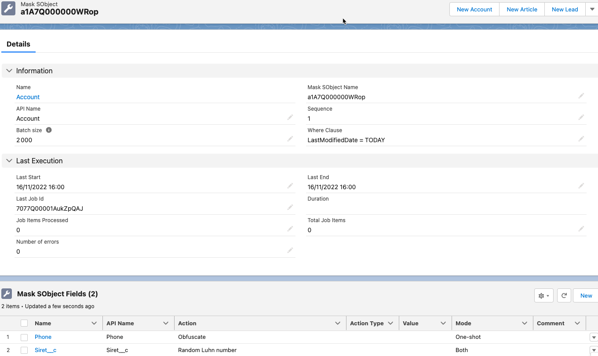
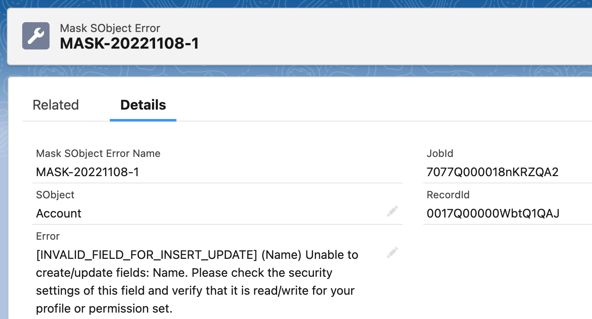

# Mask SObject Framework

This framework allow users to configure some data masking operations on **Sandbox environments**.

# Disclaimer
Mask SObject Framework is not an official Salesforce product, it has not been officially tested or documented by Salesforce.


## How Do You Configure SObjects And Fields to Mask ?

The configuration is based on two objects:

- MaskSObject__c : object to mask with options such as the order sequence and the where clause
- MaskSObjectField___c : field to mask and the option of masking (erase, randomize ...)


[](./screenshots/MaskSObject.png)

To assign required pset run following command:
```sh
sfdx force:apex:execute -f scripts/assignPset.apex
```


If you want to insert demo data, please run following command:
```sh
sfdx force:apex:execute -f scripts/importDemo.apex
```
## How To Run Data Masking ?

### One-shot mode
The maskfield actions will be executed only if the Mode__c is set to 'One_shot' or 'Both' values.

- With execute anonymous and the following code
	- To run the masking on all objects
```java
MaskSObjectUtils.executeBatch('%');
```
- To run on a particular SObject
```java
MaskSObjectUtils.executeBatch('Contact');
```

### Scheduled mode

You can schedule MaskSObjectBatchSchedulable class to execute periodically.
Since this usage is quite different from the one-shot anonymization and address project run business needs, the maskfield actions will be executed only if the Mode__c is set to 'Scheduled' or 'Both'

### Manually

Using [Launch Batch LWC](https://github.com/tprouvot/launch-batch-lwc)

## Actions
- Randomize:
	- Generate a X char String based on `Crypto.generateAesKey(128);` method where X is the number of characters of the input to anonymize.
		> 'SALESFORCE.COM FRANCE' => 'iih5e2UT0qGZ8fJaNCbTT'

- Random Luhn number
	- Generate a number considered as valid by Luhn algorithm [Luhn algorithm](https://en.wikipedia.org/wiki/Luhn_algorithm), the number of characters to generate is calculated from the original input field value.

- Obfuscate:
	- Replace and lowercase following chars (customizable in settings) `{'a', 'e', 'i', 'o', '1', '2', '5', '6'};` by `'x'`
		> 'SALESFORCE.COM FRANCE' => 'sxlxsfxrcx.cxm frxncx'
- Erase:
	- > 'SALESFORCE.COM FRANCE' => ''
- Replace:
	- Actions Types:
		- Hardcoded: You must insert an hardcoded value in Value__c field to replace the current field value with hardcoded one.
		- Dictionary:
			- You can choose different dictionary fields to replace the current value **Firstname, Lastname, Fullname, Email, Company Name, Street**.
			- A random line from MaskSObjectDictionary.json file will be selected to fill the field.
		 > Dictionary Firstname : 'Thomas' => 'Corie', Dictionary Fullname : 'John Doe' => 'Corie Joberne' ...

## Data Dictionary
The data dictionary is stored in **MaskSObjectDictionary.json StaticResource**.
You can edit this file and replace the current values with yours if you need more common names for a particular country for example.

Website used to generate the data https://www.mockaroo.com/

## Fields specificity
- Standard Email
	- We mask only the part **before** the domain name
  		> 'jdoe@salesforce.com' => 'iih5@salesforce.com'
- Standard Phone
	- We mask only the part **after** the two first char
  		> '0612345678' => '0600340078'

## Configure Settings
You can customize some options by editing MaskSObjectSettings__mdt Default Custom Metadata
- Allow execution on prod : enable this option to be able to run the batch on PROD (otherwise soql query returns no rows)
- Configure the number of digits to preserve in standard Phone fields.


## Manage Errors
Mask SObject Framework may throw some errors during the run, due to validation rules or implementation specificity in your org.
To be able to track and manage those errors, we implemented the MaskSObjectError__c object.



If you want to, you can disable the error's record creation in the custom metadata settings.

### Errors Purge
You can manage logs purge with the framework [SObject Purge Framework](https://github.com/tprouvot/purge-sobject)

## Deploy to Salesforce

Checkout the repo and deploy it with sfdx:
```sh
sfdx force:source:deploy -p force-app
```

Use GitHub Salesforce Deploy Tool:

[](https://githubsfdeploy.herokuapp.com/?owner=tprouvot&repo=mask-sobject&ref=master)
