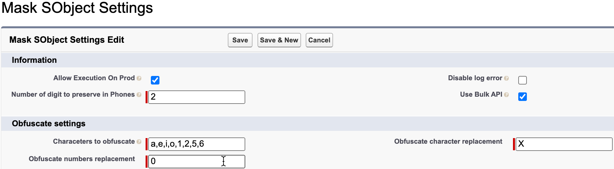

# Mask SObject Framework

This framework allow users to configure some data masking operations on **Sandbox environments**.

# Disclaimer
Mask SObject Framework is not an official Salesforce product, it has not been officially tested or documented by Salesforce.


## How Do You Configure SObjects And Fields to Mask ?

The configuration is based on two objects:

- MaskSObject__c : object to mask with options such as the order sequence and the where clause
- MaskSObjectField___c : field to mask and the option of masking (erase, randomize ...)


[](./screenshots/2022-08-10_09-42-09.png)

To assign required pset run following command:
```sh
sfdx force:apex:execute -f scripts/assignPset.apex
```


If you want to insert demo data, please run following command:
```sh
sfdx force:apex:execute -f scripts/importDemo.apex
```
## How To Run Data Masking ?

- With execute anonymous and the following code
	- To run anonymisation on all objects
```java
MaskSObjectUtils.executeBatch('%');
```
- To run on a particular SObject
```java
MaskSObjectUtils.executeBatch('Contact');
```

- When creating / refreshing a sandbox:


**WARNING**: if you choose this option, you need a Partial Copy Sandbox or a Full Copy Sandbox and data configuration on Production.

- Manually using [Launch Batch LWC](https://github.com/tprouvot/launch-batch-lwc)

## Actions
- Randomize:
	- Generate a X char String based on `Crypto.generateAesKey(128);` method where X is the number of characters of the input to anonymize.
		> 'SALESFORCE.COM FRANCE' => 'iih5e2UT0qGZ8fJaNCbTT'
- Obfuscate:
	- Replace and lowercase following chars `{'a', 'e', 'i', 'o', '1', '2', '5', '6'};` by `'x'`
		> 'SALESFORCE.COM FRANCE' => 'sxlxsfxrcx.cxm frxncx'
- Erase:
	- > 'SALESFORCE.COM FRANCE' => ''
- Replace:
	- Actions Types:
		- Hardcoded: You must insert an hardocoded value in Value__c field to replace the current field value with hardcoded one.
		- Dictionary:
			- You can choose different dictionary fields to replace the current value **Firstname, Lastname, Fullname, Email**.
			- A random line from MaskSObjectDictionary.json file will be selected to fill the field.
		 > Dictionary Firstname : 'Thomas' => 'Corie', Dictionary Fullname : 'John Doe' => 'Corie Joberne' ...

## Data Dictionary
The data dictionary is stored in **MaskSObjectDictionary.json StaticResource**.
You can edit this file and replace the current values with yours if you need more common names for a particular country for example.

Website used to generate the data https://www.mockaroo.com/

## Fields specificity
- Standard Email
	- We mask only the part **before** the domain name
  		> 'jdoe@salesforce.com' => 'iih5@salesforce.com'
- Standard Phone
	- We mask only the part **after** the two first char
  		> '0612345678' => '0600340078'

## Configure Settings
You can customize some options by editing MaskSObjectSettings__mdt Default Custom Metadata
- Allow execution on prod : enable this option to be able to run the batch on PROD (otherwise soql query returns no rows)
- Configure the number of digits to preserve in standard Phone fields.




## Deploy to Salesforce

Checkout the repo and deploy it with sfdx:
```sh
sfdx force:source:deploy -p force-app
```

Use GitHub Salesforce Deploy Tool:

[](https://githubsfdeploy.herokuapp.com/?owner=tprouvot&repo=mask-sobject&ref=master)
